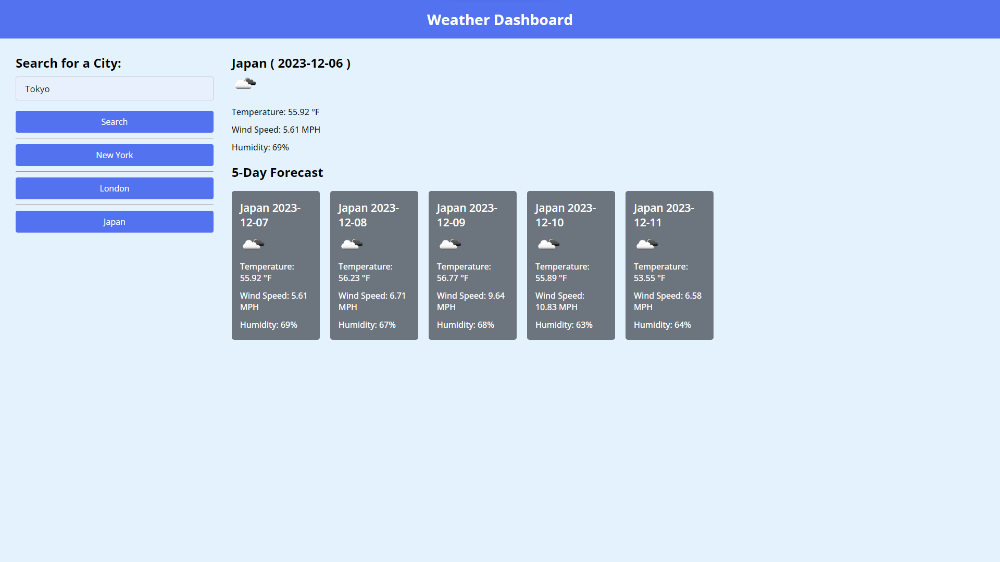

# Project title: Weather Dashboard

## Description

- My motivation on doing this project was to earn a new skill.

- I builded that project to apply what I've learned.

- I have created a Weather Dashboard using OpenWeather. Where the user searches for a city weather information it displays city name, date, temperature, wind speed and humidity for current day and the next 5 days. Each time the user searches for a city will dynamically create a search history button with city name and save it with its weather information to local storage on page load it remains on its place, when the user try to click on search history buttons each button will again display the weather information of that city.

- I learned about Server Side APIs (fetch and its structure), dynamically creating html elements, localStorage for objects.

## Installation

Download the files from the repository and install.

# Usage

Link to view: [Weather Dashboard](https://mariamdawood.github.io/Weather-Dashboard/)

Screenshot of website:

# Credits

TA

AskBCS

# Reference

used CSS template: https://www.codingnepalweb.com/weather-app-project-html-javascript/
API: https://openweathermap.org/forecast5

